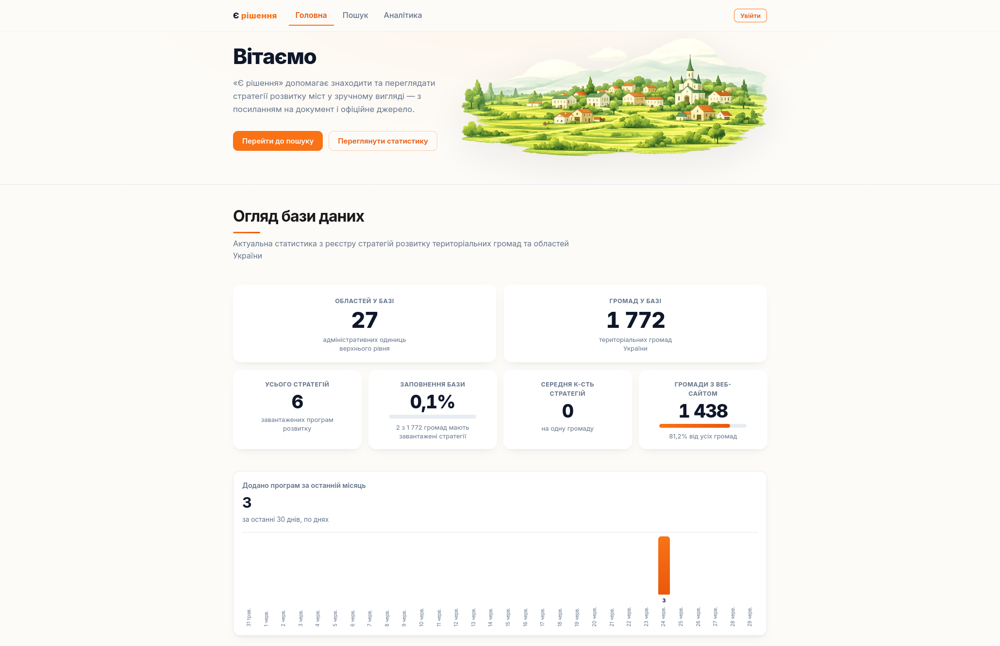
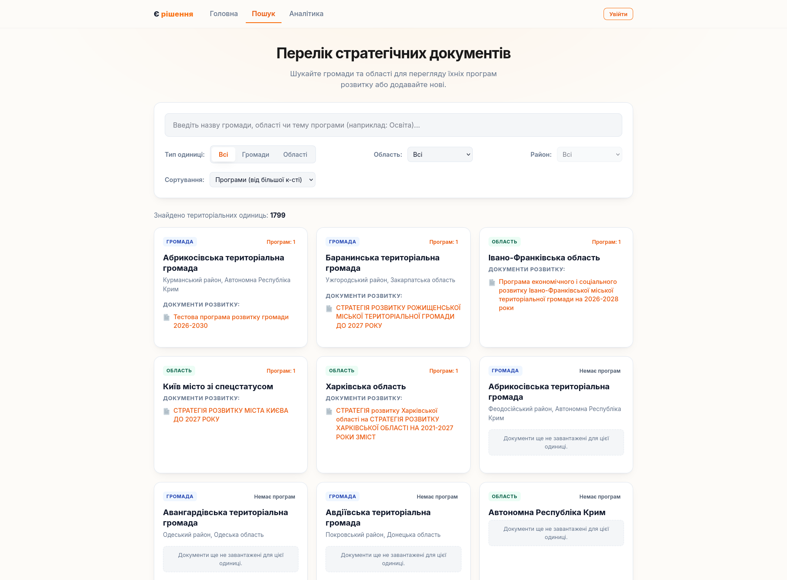
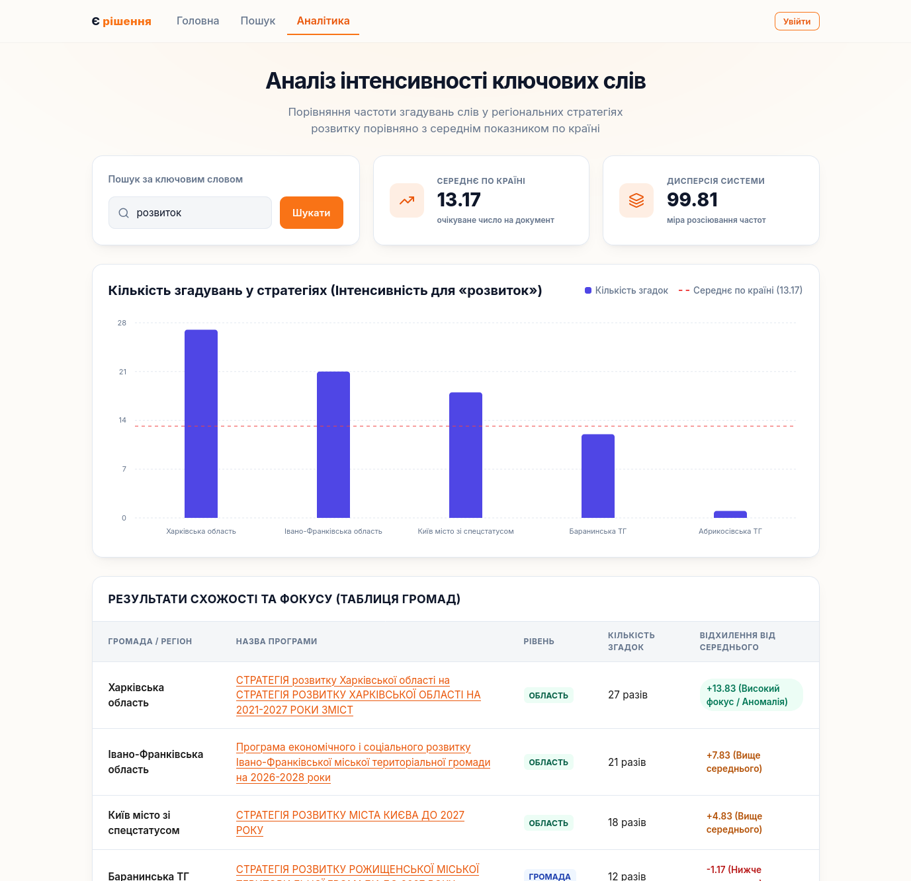
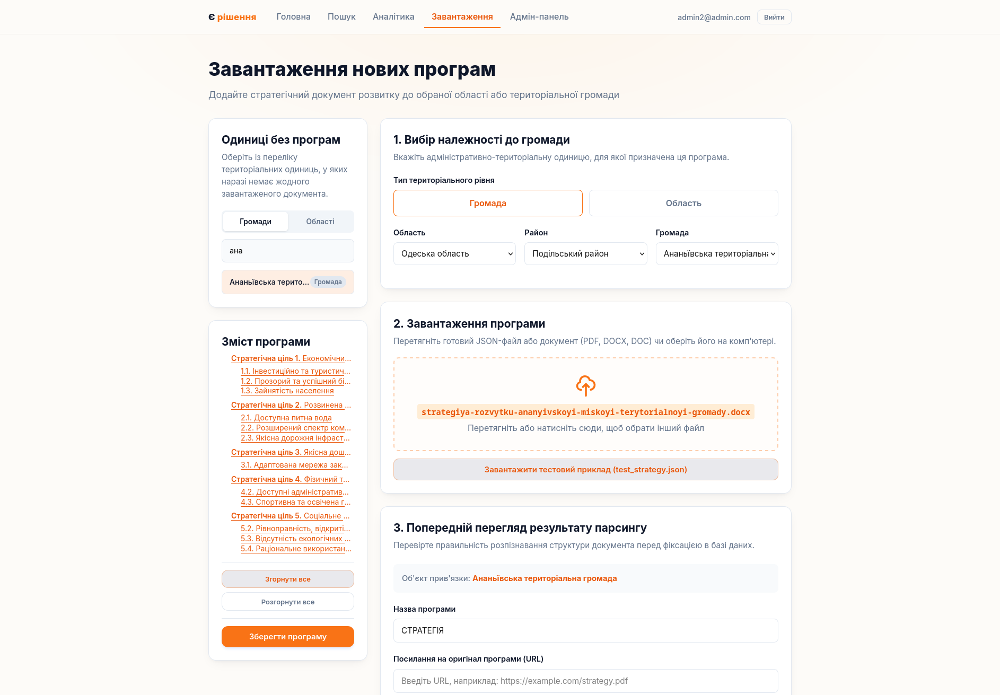

# «Є рішення» — Платформа для аналізу програм розвитку громад

Платформа призначена для прозорого збору, структурування та аналізу стратегічних програм розвитку українських громад.

---

## Ключові можливості (Features)

* **Інтерактивне дерево цілей:** Перегляд повної ієрархічної структури стратегій розвитку громади (Стратегічні цілі → Операційні цілі → Заходи/Задачі) з можливістю динамічного згортання та розгортання великих масивів тексту.
* **Пошук, фільтрація та сортування:** Миттєва навігація по реєстру громад за ключовими словами, типом адміністративної одиниці (Громада/Область) та сортування за кількістю завантажених програм.
* **Розумне завантаження та розпізнавання:** Автоматичний парсинг документів у форматах JSON, PDF, DOC, DOCX з розпізнаванням ієрархії цілей, об'єднанням перенесених рядків та можливістю інтерактивного редагування структури перед фінальним збереженням у БД.
* **Лінгвістичний аналіз ключових слів:**
    * Автоматичний підрахунок частоти вживання слів у текстах стратегій.
    * Інтеграція з Python-сервісом лематизації для приведення слів до базової форми (наприклад, *"освітою", "освіти" → "освіта"*).
    * Інтерактивна візуалізація: стовпчикові діаграми частот із лінією «Середнє по країні», розрахунок дисперсії та таблиця відхилень.
* **Авторизація та керування правами доступу:** Рольова модель (Користувач / Адміністратор) на основі захищених JWT-токенів (AccessToken & RefreshToken) для безпечного внесення змін та адміністрування контенту.

---

## Screenshots

| Головна сторінка (Home Page) | Пошук та фільтрація (Search & Filtering) |
| --- | --- |
|  |  |

| Аналітика (Analytics) | Панель адміністратора (Admin Panel) |
| --- | --- |
|  |  |

## Структура проєкту

Проєкт організований як монорепозиторій, що містить клієнтську частину (Frontend), сервер (Backend) та мікросервіс для обробки природної мови (NLP).

### Загальний огляд

* **[client](file:///home/masjlina/boot%20camp/Programs-Strategies/client)** — Клієнтська частина платформи. Веб-додаток, розроблений на React + Vite + TypeScript.
* **[server](file:///home/masjlina/boot%20camp/Programs-Strategies/server)** — Серверна частина платформи. ASP.NET Core Web API додаток на C#.
* **[nlp-service](file:///home/masjlina/boot%20camp/Programs-Strategies/nlp-service)** — Мікросервіс для лінгвістичного аналізу та лематизації українських слів на FastAPI (Python).
